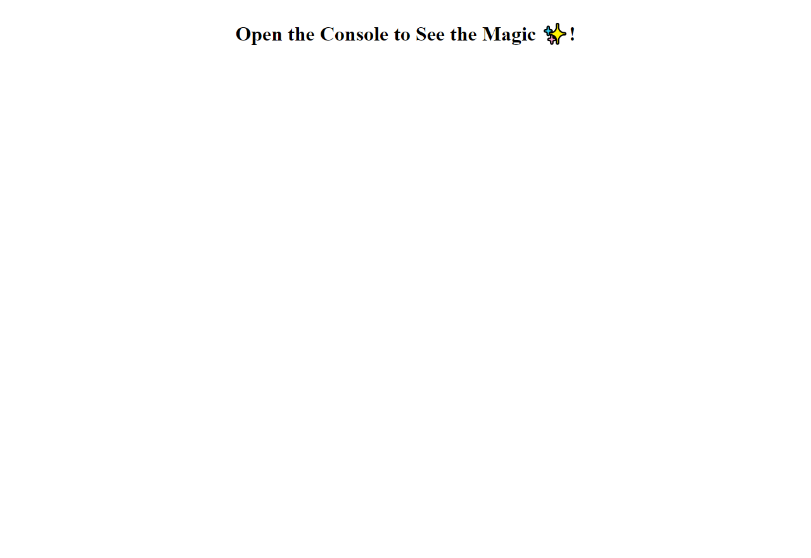
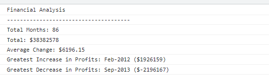

# Console-Finances

Making a javascript program to analyze an array of data

## Project Links
Deployed Link: https://nrprabhav.github.io/Console-Finances/

Repository Link: https://github.com/nrprabhav/Console-Finances

## Description
The project is a coding practice for javascript. In this program, I analyze a 2D array of financial data which contains the month information along with how much profit/loss is made by the company. I analyze the data given to calculate parameters such as total profit, average change in profit, greatest increase in profits and greatest decrease in profits.

## Using the project
To see the output you will have to open the console.

## Screenshot

The HTML output looks as below:

The console output is given below:

